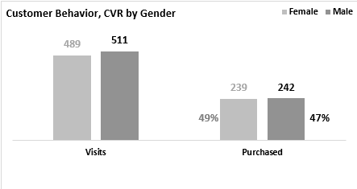

# Bike Buyers Analysis


https://github.com/user-attachments/assets/7a653adf-cba6-4843-ab18-ff719a1a6de1


**Snapshot of the Simple Dashboard produced for this project.**


# Introduction

This project produced a simple dashboard using the dataset collected by a bike sales business. The dataset consisted of customer demographics and customer behavior.

The dashboard used clearly labelled charts to present results from analyses of the CLEANED, UNFILTERED dataset and the analysis of the dataset FILTERED based on Gender, Marital Status, and Region.

Analysis of Customer Behavior by age, gender, and income class produced invaluable insights that could be useful to the business. For instance, **REGION PERFORMANCE ANALYSIS (in terms of conversion rate of customers)** was actualized and presented.

This project is SIMPLISTIC and involves only the use of the Data Validation Tool, Excel expressions, and Charts. Advanced tools like PIVOT TABLE, POWER QUERY, and POWER PIVOT were not involved.


#### P/S: 
**This is ONLY A SIMPLE ILLUSTRATION TO PRESENT A DIFFERENT INSIGHT INTO THE POPULAR DATASET.**

#### DISCLAIMER: 
**The data for this project was gotten from ALEX THE ANALYST.
https://github.com/AlexTheAnalyst**


# Background

Organizations rely on data to enable them to understand their business performance and make decisions that will impact future operations. So long as the dataset used is accurate and devoid of errors, it is believed that decisions made (based on the data) are unbiased and give a true picture of events.

A Bike Sales Outlet, ABS Cycles, collected Bike Buyers Data comprising customer personal information, and customer behavior (whether they made a purchase or not) from three regions where the business operated. The business wanted to know if this available data was useful in any way, and if the dataset could subsequently provide insights that could form a basis for any future decision.


The following are the questions to be answered;
1.	Can any information (useful to the business operation) be derived from the data set?
2.	Is the business Gender specific? 
3.	Which age group is MORE LIKELY to make a purchase?
4.	What Income Groups did the business appeal to? 
5.	Which Region had the most visits?
6.	Which Region had the highest conversion rate (i.e., the highest percentage of visitors that made a purchase)?


# Tools (I) Used

To analyze the data and present the results, certain tools were needed. For this project, only one tool was applied, which was capable of analyzing the data and producing visualizations of the results. 

**Microsoft Excel** was the ONLY tool used in this project

1. To perform data cleaning, such as checking for missing values and removing duplicate records.

2. To perform data transformation (by modifying data structure, value, and format) and data manipulation (by applying logic to derive different and more refined data) to ensure data consistency.

3. Apply the Data Validation tool used to constrain data selection to a predefined set and provide the values used in dataset filtering.

4. Construct the Charts and other visuals that compose the dashboard.

# The Analyses

This section deals with the assessment of the dataset in the attempt to answer the questions earlier stated.

The techniques applied in the assessment and in deriving the results as well as the results obtained are presented.
## Q1. Can any information (useful to the business operation) be derived from the dataset?

This question addresses the issue of whether the dataset collected by the organization (if interrogated) can produce any helpful information to the (future operations of the) business.

A **VISUAL INSPECTION** of the dataset was performed to identify and to understand the type(s) of information collected. 


[See Bike Buyers Dataset here](/Excel%20Project%20Dataset_from_AlexTheAnalyst.csv)

### Key Finding(s):

1. From inspection, the dataset comprised mostly of customers’ information (a.k.a customer demographics), WHICH IS USEFUL TO THE BUSINESS’S MARKETING STRATEGY.


2. The dataset presented information on whether a customer purchased a bike or not. This customer behavior was critical to the evaluation of CONVERSION RATE, a key performance indicator that shows the percentage of visitors that ended up as buyers.


### Business Insight(s):

1. **CUSTOMER DEMOGRAPHIC** data made available, which is useful for MARKETING STRATEGY development.

2. Performance evaluation of Customers and Region were made poossible by the  **CONVERSION RATE**, a key performance indicator. **In the retail business, knowledge of the percentage of customers who made a purchase on visiting a business is vital.**


## Q2: Is the business gender specific?

This dealt with investigating whether a particular gender patronized the business more than others.

1. The dataset was cleaned, transformed, and manipulated. Afterwhich it was converted to a table and named appropriately (Bike_Customers_Data).

2. The total number of customers that visited, the total number of customers that made a purchase, and the conversion rate of the customers (from ALL LOCATIONS) by gender were calculated. 

3. Different separate Excel expressions were formulated to filter for the number of visitors, and the number of visitors THAT MADE A PURCHASE, all as a function of the stated gender.

Excel commands applied include;
``` Excel

=COUNTIF(Bike_Customers_Data[Gender],A3)

=COUNTIFS(Bike_Customers_Data[Gender],A3,Bike_Customers_Data[Purchased Bike],"Yes")

```

Alternative commands that achieve the same results are ;
```Excel

=SUMPRODUCT(--(Bike_Customers_Data[Gender]=A3))

=SUMPRODUCT(--(Bike_Customers_Data[Gender]=A3)*(Bike_Customers_Data[Purchased Bike]="Yes"))

```


*Chart showing variation of Customer Behavior and Conversion Rate by Gender*

### Key Finding(s):

1. Based on gender, there was an equal magnitude in the number of CUSTOMERS that visited. Only a 4% percent difference in the number of visitors.

2. An almost equal number of customers (by gender) made a purchase; a one percent (1%) difference.

3. Conversion Rate (CVR) by gender varied by two (2) percentage points; 49% to 47%.
Though the business had a lower number of female visitors, a fractionally higher percentage made a purchase.

### Business Insight(s):
1. The company should continue with the types of bikes being sold as all genders seem to find a product that appealed to them.
